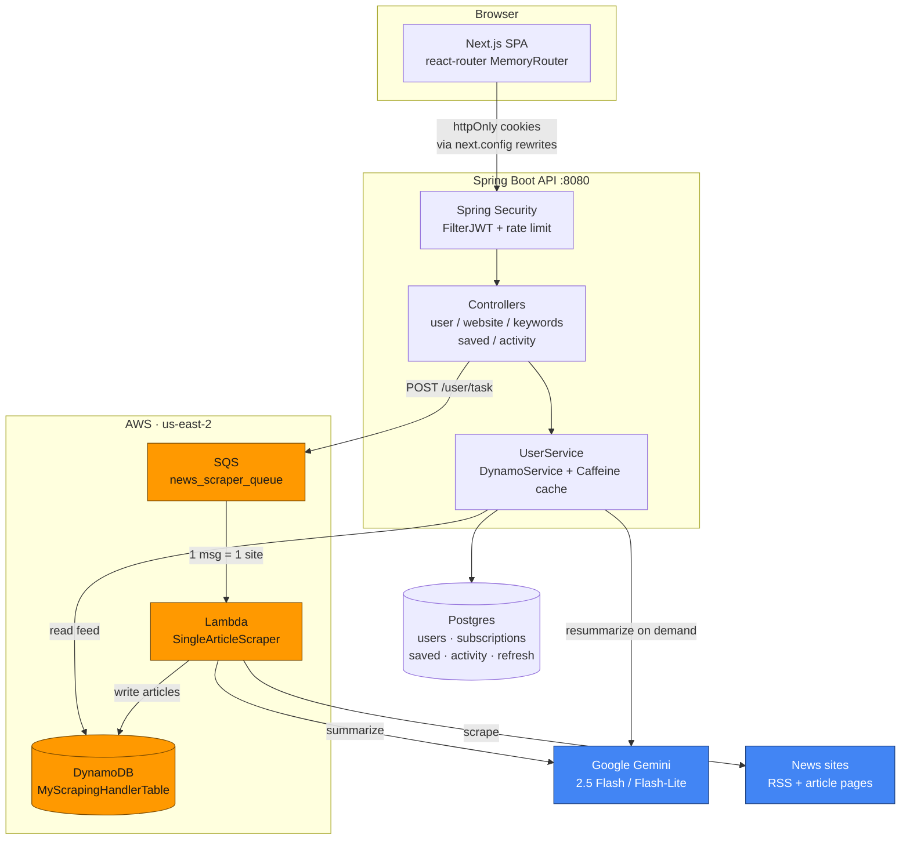
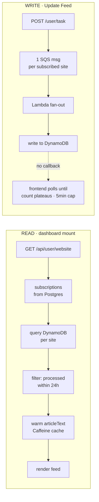
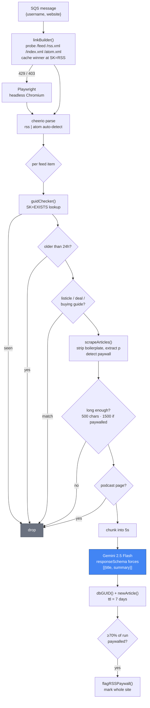
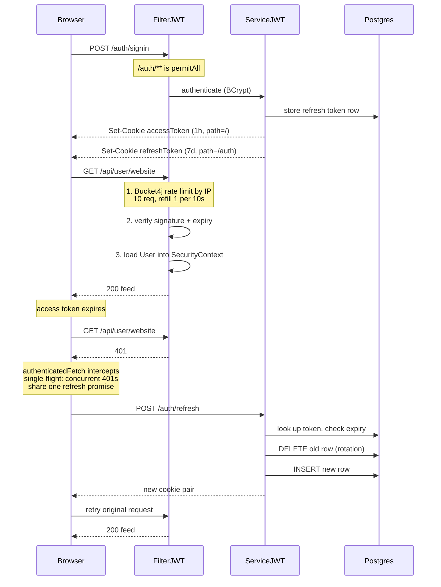
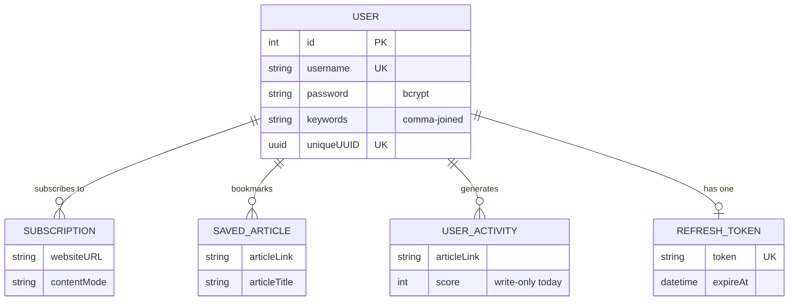
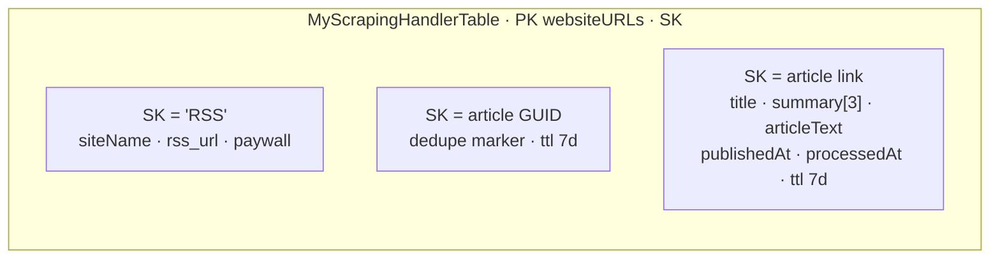
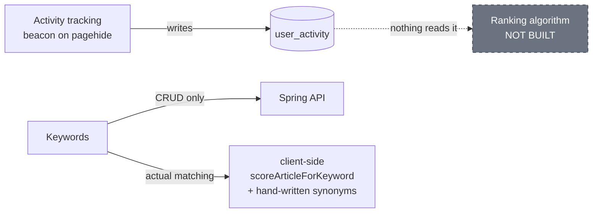

# Signal — Architecture

A personalized news briefing app. Subscribe to news sites, a scraper pulls their RSS
feeds, Gemini summarizes each article at three depths, and a dashboard serves the briefing.

- **Frontend** — Next.js 16 / React 19 / Tailwind v4 (`frontend/`)
- **API** — Spring Boot 4.0.6 on Java 21 (`organization_api/`)
- **Worker** — Node 18 AWS Lambda (`article_grabber/`)
- **Stores** — Postgres (accounts) + DynamoDB (articles)

---

## 1. System overview

> **Without an AWS subscription** the orange boxes are dark. Nothing in the scraping or
> summarization logic is AWS-proprietary — AWS only occupies the two edges,
> transport (SQS) and storage (DynamoDB).

---

## 2. The two paths

There is **no scheduler**. Articles only appear when a user hits *Update Feed* or adds a
source. Completion is detected by polling, not by a callback.

---

## 3. Scraper pipeline — `article_grabber.js`

**Known gap:** `handler` calls `initialScraper(website)` with no mode argument, so the
per-source `websiteContentMode` never reaches the Lambda. Only the `default` summary slot
is filled at scrape time; short and deep-dive are lazy-filled later on demand.

---

## 4. Auth — JWT with refresh rotation

| | Access token | Refresh token |
|---|---|---|
| Subject | `username` | `uniqueUUID` |
| TTL | 1 hour | 7 days |
| Secret | `SECRET_KEY` | `SECRET_REFRESH_KEY` |
| Cookie path | `/` | `/auth` |
| Stored server-side | no | yes — Postgres row |

Both httpOnly, `SameSite=Strict`. Scoping the refresh cookie to `/auth` keeps it off
ordinary API calls.

**Before deploying:** `secure(false)` is hardcoded on both cookies. The refresh token is
`@OneToOne` per user, so a second device silently ends the first session. Admin gating is a
hardcoded `"rohil".equals(username)` check rather than a role system.

---

## 5. Data model

DynamoDB is a separate single-table design, joined to Postgres only in application code
via the `websiteURL` string:

`summary` is a 3-slot array: `shorter`→0, `default`→1, `longer`→2. Re-summarizing from the
UI bypasses the Lambda entirely — Spring reads cached article text from Caffeine, calls
Gemini directly, and async-writes back into the right slot.

---

## 6. Unfinished threads

- **Activity tracking is write-only** — the training signal for the ranking algorithm is
  being collected and never read. This is where the last commit's *"want to add the
  algorithm next"* points.
- **Keyword filtering is entirely client-side.** The backend does pure CRUD on a
  comma-joined string column.
- **Uncommitted WIP in `DashboardPage.tsx`** — Hot Topics mode, first-run empty states, and
  the polling plateau heuristic. It also removes the 24h display filter in three places.
- **`preferredUpdateTime`** is still editable in Settings but the code consuming it is
  commented out.
