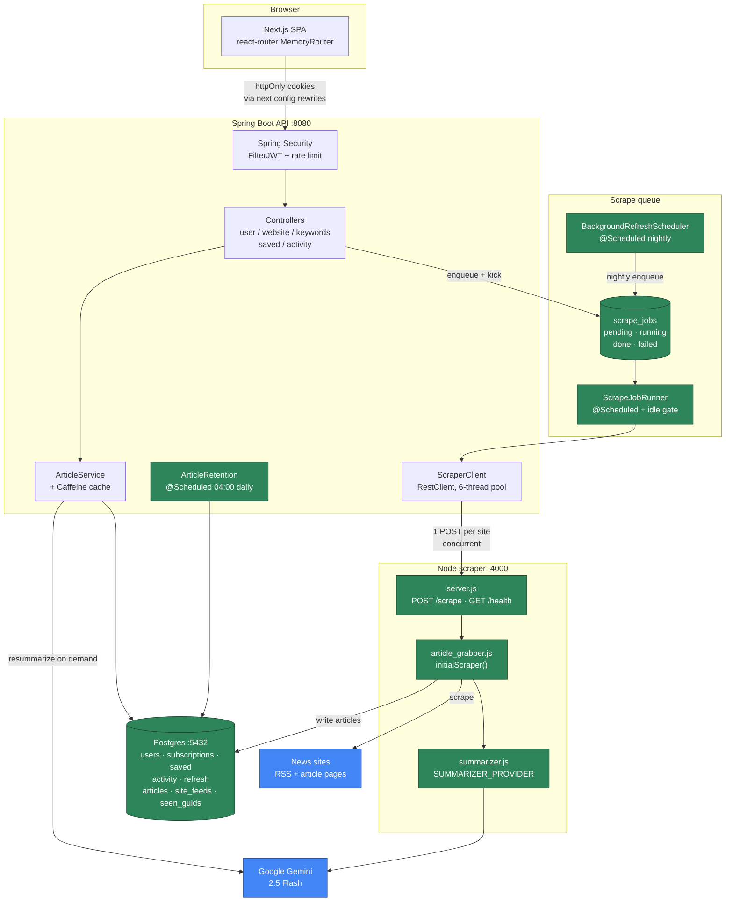
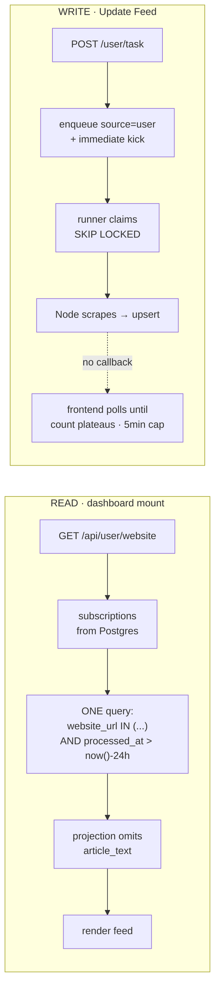
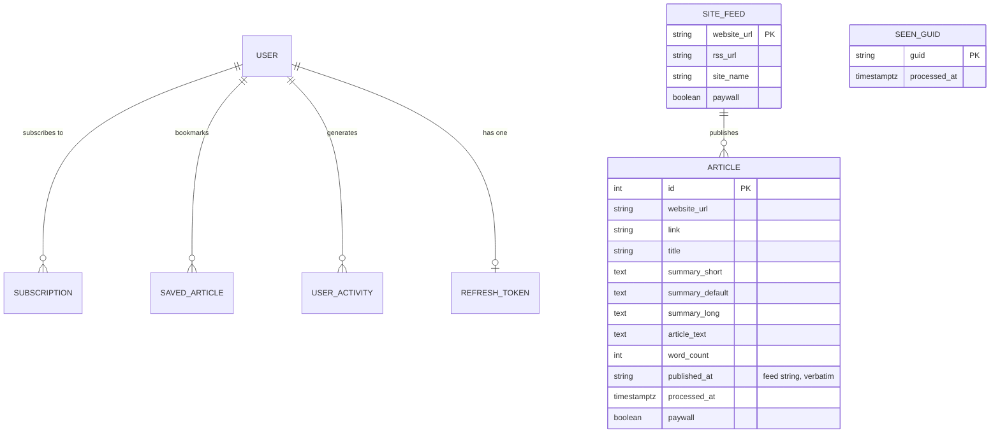
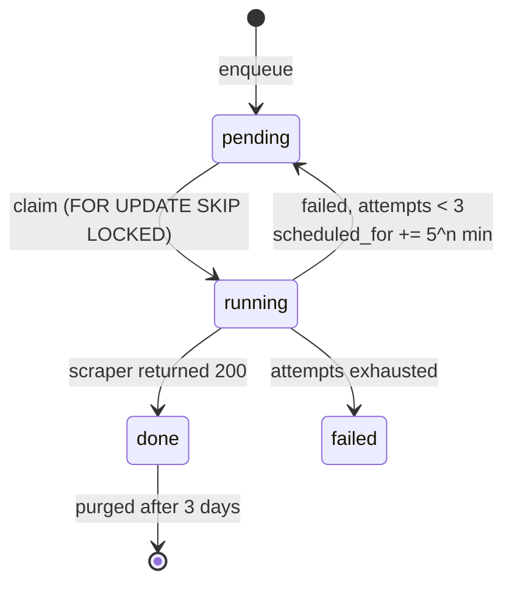

# Signal — Local Architecture

The AWS-free design. Everything runs on one machine: no SQS, no Lambda, no DynamoDB.

`ARCHITECTURE.md` describes the original cloud design and is kept as the historical record.
Where the two disagree, **this document is the one that matches the code**.

- **Frontend** — Next.js 16 / React 19 / Tailwind v4 (`frontend/`) · port 3000
- **API** — Spring Boot 4.0.6 on Java 21 (`organization_api/`) · port 8080
- **Scraper** — Node HTTP service (`article_grabber/`) · port 4000
- **Store** — Postgres, single database · port 5432

---

## 1. System overview



Every box is local except Gemini and the news sites themselves.

---

## 2. What replaced what

| Was | Now | Notes |
|---|---|---|
| SQS `news_scraper_queue` | `scrape_jobs` table + `ScrapeJobRunner` | Postgres queue with `FOR UPDATE SKIP LOCKED` |
| Lambda `SingleArticleScraper` | `article_grabber/server.js` | Long-lived local process |
| DynamoDB `MyScrapingHandlerTable` | Postgres `articles` / `site_feeds` / `seen_guids` | Single table split into three |
| Dynamo item TTL (7 days) | `ArticleRetention` `@Scheduled` sweep | Dynamo expired rows for free; Postgres needs an explicit job |
| `@sparticuz/chromium` | stock `playwright` chromium | Lambda-specific binary no longer needed |
| SQS at-least-once + retry | `scrape_jobs.attempts` + backoff | Restored: 3 attempts, 5^n minute backoff, then `failed` |

The scraping and summarization logic itself was never AWS-specific and is materially unchanged —
cheerio parsing, RSS/Atom detection, the paywall/listicle/podcast heuristics, and the Gemini
batching all survived the migration intact.

---

## 3. The two paths



`POST /user/task` still returns immediately — dispatch is fire-and-forget, exactly as the SQS
send was. The frontend's poll-until-plateau heuristic is therefore unchanged.

**Open improvement:** Spring now genuinely knows when each site finishes, so the plateau
heuristic could be replaced with an `SseEmitter` pushing real per-site progress. Not built.

---

## 4. The scraper service

`POST /scrape`

```json
{ "username": "rohil", "website": "arstechnica.com", "mode": "shorter|default|longer" }
```

| Status | Body |
|---|---|
| 200 | `{"website": "...", "articlesAdded": 14, "paywalled": false}` |
| 400 | `{"website": "...", "error": "..."}` — validation |
| 502 | `{"website": "...", "error": "Couldn't grab RSS feed for ..."}` |
| 500 | `{"website": "...", "error": "..."}` — anything else |

`GET /health` → `{"status":"ok"}`

Each request is independently try/caught, so one failing site never takes down the process —
this replaces the isolation that separate Lambda invocations used to provide.

Playwright is a **fallback only**, triggered on 429/403/503, and browser launches are capped by
`p-limit` (`BROWSER_CONCURRENCY`, default 3).

### Content modes

Three vocabularies exist for the same three-way concept. The translation lives in
`ScraperClient`, which is the boundary between them:

| Stored in `subscriptions` | Sent to scraper | Column written |
|---|---|---|
| `short` | `shorter` | `summary_short` |
| `standard` | `default` | `summary_default` |
| `deepDive` | `longer` | `summary_long` |

Unrecognised or empty modes fall back to `default` with a warning. Guarded by
`ScraperClientModeTest`.

---

## 5. Data model



`articles` has `UNIQUE (website_url, link)` (`uk_articles_site_link`) and an index on
`(website_url, processed_at)`.

`SITE_FEED ||--o{ ARTICLE` is a logical relationship joined on `website_url`, not a
declared foreign key.

### Two things that are load-bearing

**Writes upsert one summary column at a time.** The old Dynamo `PutCommand` replaced the whole
item and rebuilt `summary` as `["","",""]`, silently wiping user-requested resummarizations.
`newArticle` now does `ON CONFLICT ... DO UPDATE` naming only the column for the mode being
scraped. The other two are never mentioned in the statement, so they cannot be clobbered.

**`published_at` is text, not a timestamp.** It's whatever string the feed supplied and the
frontend renders it verbatim. Only `processed_at` is a real `timestamptz`, because that's what
the 24-hour freshness filter and the retention sweep query.

---

## 6. Running it locally

Four processes, plus Postgres:

```
postgres          # brew services — already running
cd organization_api && ./mvnw spring-boot:run      # :8080
cd article_grabber && node server.js               # :4000
cd frontend && npm run dev                         # :3000
```

**Gotchas, all of which have bitten:**

- **`npx playwright install chromium` is required once** after `npm install`. npm's install-script
  sandbox blocks it from running automatically, and without it the Playwright fallback can't launch.
- **Start the scraper from `article_grabber/`.** `dotenv` resolves `.env` against the process
  CWD, so launching from elsewhere silently loses `GEMINI_API_KEY`.
- **`OLLAMA_HOST` is exported in `~/.zshrc`** pointing at a LAN box. Any Node process started
  from that shell inherits it.

### Configuration

| Where | Key |
|---|---|
| `organization_api/src/main/resources/application.properties` | `scraper.base-url`, `spring.datasource.*`, `GEMINI_API_KEY`, `SECRET_KEY`, `SECRET_REFRESH_KEY` |
| `article_grabber/.env` | `GEMINI_API_KEY`, `PGPASSWORD` |
| `article_grabber` env (optional) | `SCRAPER_PORT`, `DATABASE_URL`/`PG*`, `BROWSER_CONCURRENCY`, `SUMMARIZER_PROVIDER` |

---

## 7. The scrape queue

`scrape_jobs` is the SQS replacement. A job carries `username`, `website_url`, an
already-translated `mode`, a `status`, and a `source`.



`FOR UPDATE SKIP LOCKED` is what makes this a queue rather than a table two workers can
both read — a locked row is invisible to the next caller instead of blocking it.

**Why a table and not a cron.** The job survives the machine being asleep, the scraper
being down, or the API restarting. A timed scrape fires into the void; queued work drains
whenever the machine is next available. That is the property SQS was actually providing.

### Who runs what, and when

| Source | Queued by | Runs |
|---|---|---|
| `user` | Update Feed / adding a source | Immediately — `kick()` claims without waiting for the poll tick |
| `scheduled` | `BackgroundRefreshScheduler`, nightly | Only while the machine is idle |

Idle is measured from macOS IOKit:

```
ioreg -c IOHIDSystem | awk '/HIDIdleTime/ {print int($NF/1000000000); exit}'
```

Below `scrape.idle-minutes`, only `source=user` jobs are claimed. Where the check is
unavailable (non-macOS, command failure) it returns -1 and the gate opens, so the queue
never silently stops draining on a machine we cannot measure.

`ScrapeJobRunner` drains; `BackgroundRefreshScheduler` enqueues. They are separate because
`UserService` depends on the runner to kick user jobs, so the runner cannot depend on
`UserService` without a bean cycle.

### Configuration

| Key | Default | Meaning |
|---|---|---|
| `scrape.poll-interval-ms` | 60000 | Gap between drains (`fixedDelay`, so a slow batch cannot stack) |
| `scrape.max-concurrent` | 3 | Worker threads |
| `scrape.batch-size` | 3 | Jobs claimed per drain |
| `scrape.idle-minutes` | 15 | Idle threshold; `0` disables the gate |
| `scrape.enqueue-cron` | `0 0 3 * * *` | When background refresh is queued |
| `scrape.purge-cron` | `0 30 4 * * *` | Clears finished jobs older than 3 days |

---

## 8. Swapping the summarizer

`summarizer.js` exposes one function and a provider map:

```js
summarize(articles, mode) -> [{ title, summary }]
```

Selected by `SUMMARIZER_PROVIDER`. **The default is `ollama`** — summarization runs on a
local model; set `gemini` to fall back to the hosted one. Batch size is provider-aware
(`batchSize()`): 5 for Gemini, 3 for Ollama.

Two things matter for the local model:

- **Context window.** Articles average ~783 words; a batch of 3 is ~3,100 tokens. Ollama's
  default `num_ctx` is below that and **truncates silently** — the model never sees the tail
  of the batch and returns fewer entries than it was given. `OLLAMA_NUM_CTX=8192`.
- **Resident size is not download size.** `qwen3:4b` downloads as 2.5 GB but is **3.9 GB
  resident at `num_ctx` 8192, and 5.1 GB at 16384** — the KV cache is most of the difference.
  On a 16 GB machine also running the JVM, Postgres, Next, and Chromium, that gap decides
  whether the box swaps. `OLLAMA_KEEP_ALIVE=60s` releases it between scrapes.

### Structure comes from the schema, not the prompt

`longer` asks for exactly three paragraphs. Asking in prose does not work — measured on 10
real articles, `qwen3:4b` produced one paragraph in **9 of 10** cases despite the prompt
saying "MUST write exactly 3 paragraphs. No more, no fewer."

The fix is to make the shape unrepresentable rather than discouraged: for `longer`, the
schema declares `summary` as an object of `happened` / `context` / `implications`, and the
three fields are rejoined with blank lines before storage. **10 of 10 after the change**,
average length 862 → ~1,550 chars. `summary_long` stays a plain text column.

Use the same trick for any future format requirement — a constrained schema is enforced
during generation; a prompt rule is only a suggestion.

---

## 9. Unfinished threads

Carried over from the original design and still true:

- **Activity tracking is write-only.** `user_activity` is collected and nothing reads it. This is
  where the ranking algorithm was meant to go.
- **Keyword filtering is entirely client-side.** The backend does CRUD on a comma-joined string.
- **`preferredUpdateTime`** is editable in Settings but the code consuming it is commented out.
- **`preferredUpdateTime` is not wired to the queue.** `BackgroundRefreshScheduler` uses one
  global cron for every user; the per-user time in Settings is still ignored. That field is
  the natural input for `scrape.enqueue-cron`.

New since the migration:

- **`article_grabber/function.zip`** is the stale 82 MB Lambda bundle. It is dead weight, is
  still tracked in git, and contains a `.env` with a Gemini API key.
