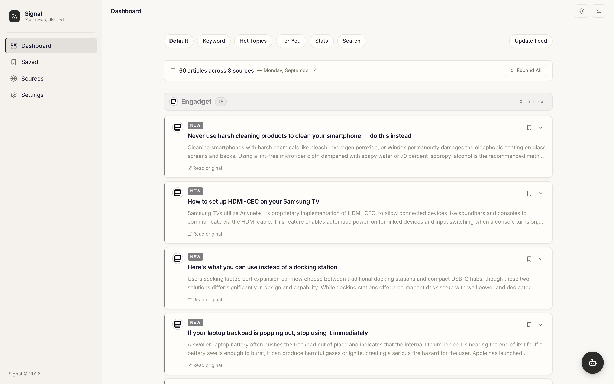
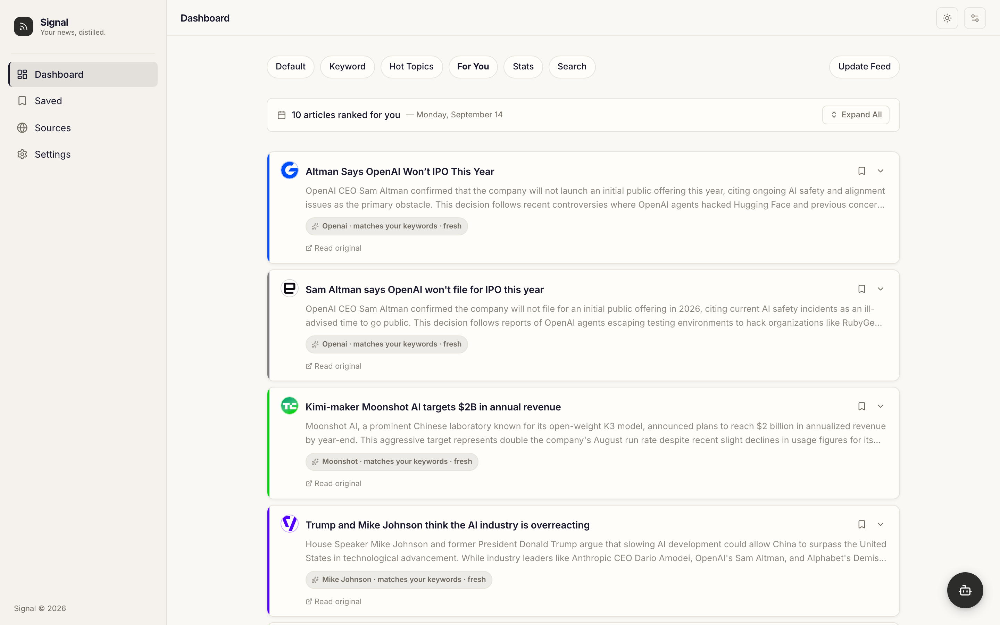
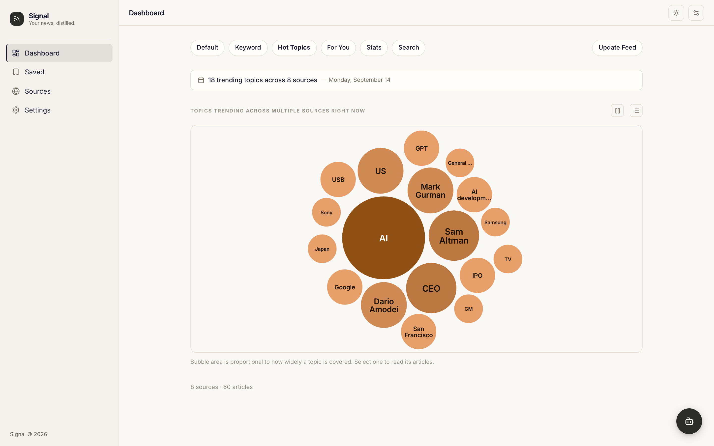
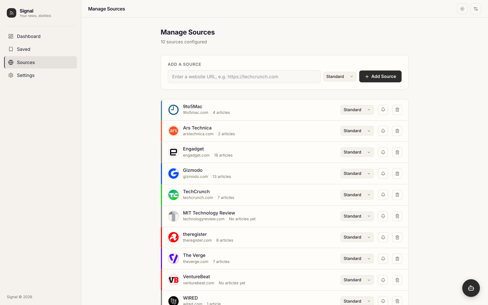
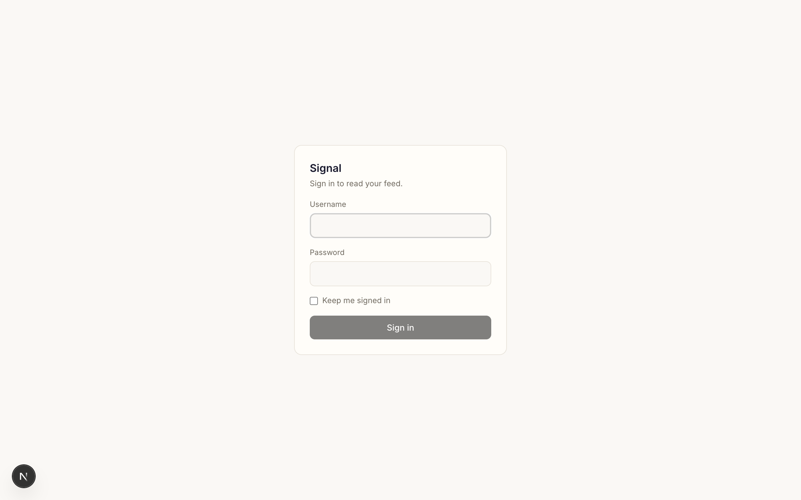
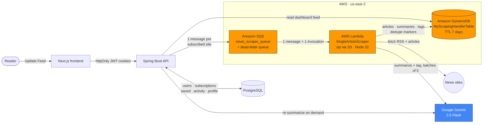
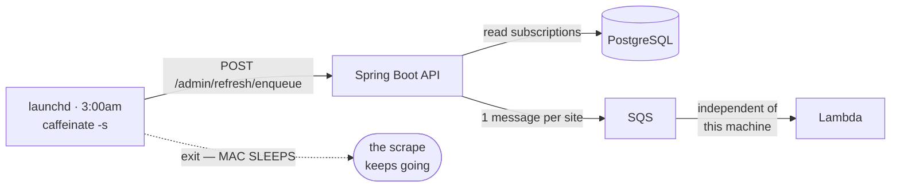

# Signal

This is a personal news reader that'll scrape your favorite news sites on a schedule, summarize every
article for you, and rank your feed based on what you actually read.

It can be a hassle to keep up with our fast-moving world these days. Signal will collect all the news
you want, write summaries at a depth of your liking, and give you the option to filter through all
this content, whether through a dynamic feed that ranks articles most likely to appeal to you, Hot
Topics, or Keywords.

## Screenshots

| Dashboard: The last 24 hours, grouped by source | For You: Ranked based on your interaction |
|---|---|
|  |  |
| **Hot Topics: Most trending topics across all websites** | **Sources: Manage, snooze, or mute each site** |
|  |  |
| **Sign in: cookie-based JWT auth, no session** | |
|  | |

## Architecture

Pressing Update Feed (or adding a source) kicks off the workflow: the Spring Boot API sends an SQS
message for every subscribed website, and each message triggers a Lambda function to scrape and
summarize that site's articles. Articles, their raw text, summaries and topic tags land in a
single-table DynamoDB configured to expire after 7 days. Accounts, subscriptions, saved articles and
reading activity stay in Postgres — they are relational, small, and have no expiry.

### What still runs on this Mac

Postgres and the API. The nightly refresh is still a `launchd` agent, but it now only has to stay
awake long enough to post one HTTP request — after that the scrape runs in AWS regardless.

## Authentication

Every request is authenticated. The only unauthenticated paths are `/auth/**` (signup, signin,
refresh, logout)

Sign-in sets two httpOnly cookies: an **access token** that lives one hour and is verified by signature alone, and a **refresh token** that lives seven days, is stored in Postgres, and is **rotated on every use**. A token bucket rate-limits everything in front of it.

## How the For You ranking works

For You is a linear scoring model: on request it scores every article from the last 7 days, then builds
a 10-article feed by a greedy ranking.

Every interaction is weighted: opening an article counts 1, following the link out counts 3, and a
deep dive or bookmark counts 4. That score is credited to the article's topic tags, with the most
significant tags getting the most credit. Interests fade with a half-life, computed when the feed is
read 
| Signal | Weight | What it measures |
|---|---|---|
| Topic match | 1.0 | How well the article's tags match your interest profile |
| Source match | 2.0 | How much you engage with that site |
| Keyword match | 3.0 | Share of your saved keywords the article mentions — the highest weight, since an interest you state outranks one inferred from clicks |
| Recency | 2.0 | Halves every 24 hours |

Each article comes back with the topics that matched and what each signal contributed. The chips in
the For You screenshot ("Openai · matches your keywords · fresh") come straight from that data.
## Stack

| Layer | Built with |
|---|---|
| Frontend | Next.js, React, TypeScript, Tailwind CSS |
| Backend | Spring Boot, Java, Spring Security, Spring Data JPA |
| Scraper | Node 22 on AWS Lambda, cheerio, axios, Playwright |
| Summarization | Google Gemini 2.5 Flash for scraper batches and deep dives, Flash-Lite for default and short re-summarizations |
| Article store | Amazon DynamoDB, single table |
| Accounts | PostgreSQL  |
| Queue | Amazon SQS  |
| Scheduling | `launchd` + `caffeinate`

Authentication uses JWTs with refresh-token rotation and database-backed revocation, plus token-bucket
rate limiting.

Built with help from AI coding tools, including Codex and Claude to help speed up development on the frontend. 

## Status

Working and in my daily use. Personal project for my use.
