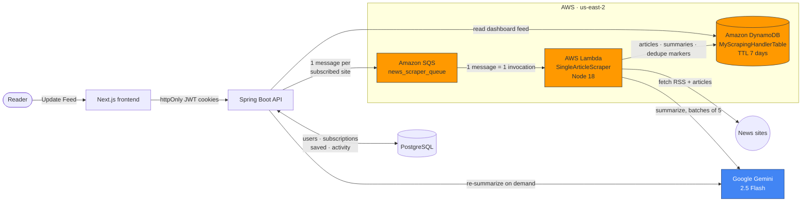
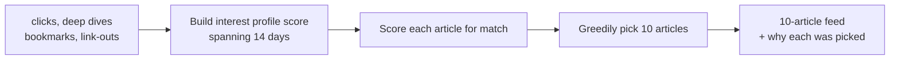

# Signal

This is a personal news reader that'll scrape your favorite news sites on a schedule, summarize every article for you, and rank your feed based on what you actually read.

It can be a hassle to keep up with our fast-moving world these days. Signal will collect all the news you want, write summaries at a depth of your liking, and give you the option to filter through all this content, whether through a dynamic feed that ranks articles most likely to appeal to you, Hot Topics, or Keywords.

## Screenshots

| Dashboard: The last 24 hours, grouped by source | For You: Ranked based on your interaction |
|---|---|
|  |  |
| **Hot Topics: Most trending topics across all websites** | **Sources: Manage, snooze, or mute each site** |
|  |  |

## Architecture

Signal was originally built on AWS, using the Gemini API for summarization. Pressing Update Feed (or adding a source) kicked off the workflow: the Spring Boot API sent an SQS message for every subscribed website, and each message triggered a Lambda function to scrape and summarize that site's articles. The articles, their raw text, and their summaries all landed in a single-table DynamoDB, configured to expire after 7 days.

### Original AWS architecture

DynamoDB used one table keyed by site, with three sort-key patterns: `RSS` for the cached feed URL and site metadata, the article GUID as a marker, and the article link for the article itself. It would contain raw article and summarized text.

My AWS student plan ended, so I switched to a fully local setup. I added a nightly launchd job so feeds now refresh on a schedule, and swapped SQS and Lambda for a Postgres job queue and one server handling concurrent requests, DynamoDB for Postgres, and Gemini for a local Qwen3.5:4B model.

## How the For You ranking works

For You is a linear scoring model, where on request, it scores each article from the last 7 days, then builds a 10-article feed.

Every interaction is weighted: opening an article counts 1, following the link out counts 3, and a deep dive or bookmark counts 4. That score is credited to the article's topic tags, with the most significant tags getting the most credit. Interests fade over 14 days, and is calculated when the feed is read. 

Scoring Articles:

| Signal | Weight | What it measures |
|---|---|---|
| Topic match | 1.0 | How well the article's tags match your interest profile |
| Source match | 2.0 | How much you engage with that site |
| Keyword match | 3.0 | Share of your saved keywords the article mentions — the highest weight, since an interest you state outranks one inferred from clicks |
| Recency | 2.0 | Halves every 24 hours |
| Already seen | −1.5 | Shown to you earlier and passed over |

Each article comes back with the topics that matched and what each signal contributed. The chips in the For You screenshot ("Openai · matches your keywords · fresh") come straight from that data, and it's also how the weights get tuned.

## Stack

| Layer | Built with |
|---|---|
| Frontend | Next.js 16, React 19, TypeScript, Tailwind CSS |
| Backend | Spring Boot 4, Java 21, Spring Security |
| Scraper | Node, cheerio, axios, Playwright |
| Summarization | Ollama (Qwen3.5:4B), Google Gemini 2.5 Flash Lite |
| Database | PostgreSQL 14 |
| Originally hosted on | AWS SQS, Lambda, DynamoDB |

Authentication uses JWTs with refresh-token rotation and database-backed revocation, plus token-bucket rate limiting.

Built with help from AI coding tools, including Codex and Claude.

## Status

Working and in my daily use. Personal project for my use.
